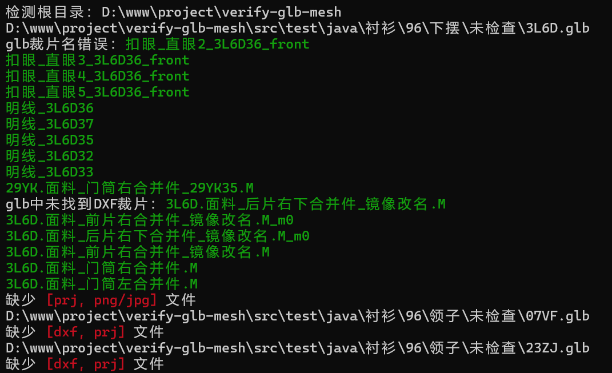
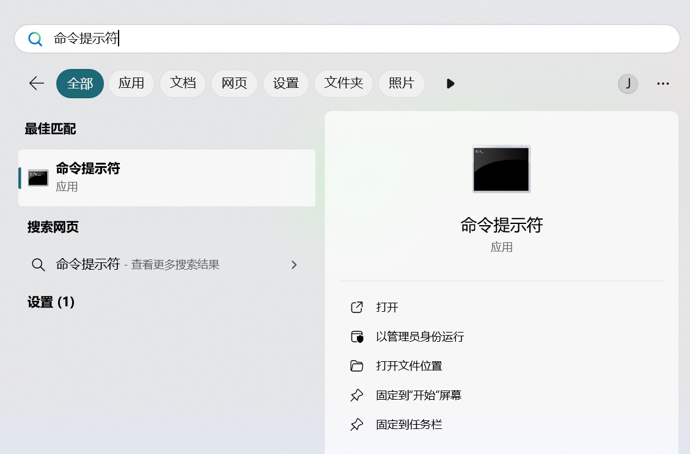
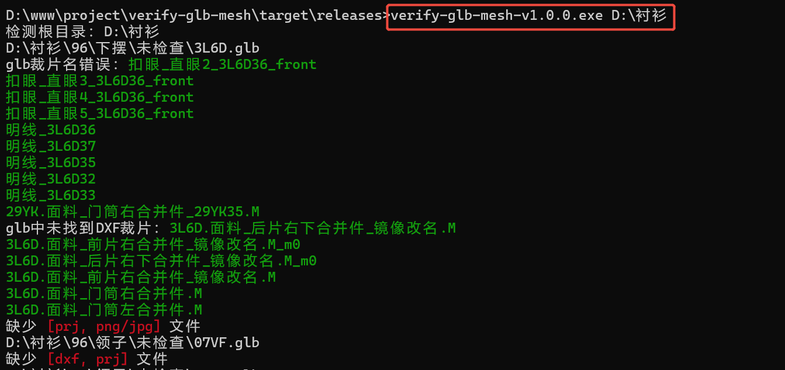

# 软件功能

遍历检测目录下"/未检查"目录下的glb文件。

1. 检测glb文件名称是否符合规则
2. 检测glb文件与dxf的裁片名称是否一致

# 使用说明

### 方式1(以当前目录开始遍历文件)

- exe文件放至待检测根目录，双击.exe文件
  

### 方式2(指定目录)

#### 1. 打开系统软件 “命令提示符”



#### 2. 执行以下命令

```shell
./verify-glb-mesh-v1.0.0.exe D:\衬衫
```




